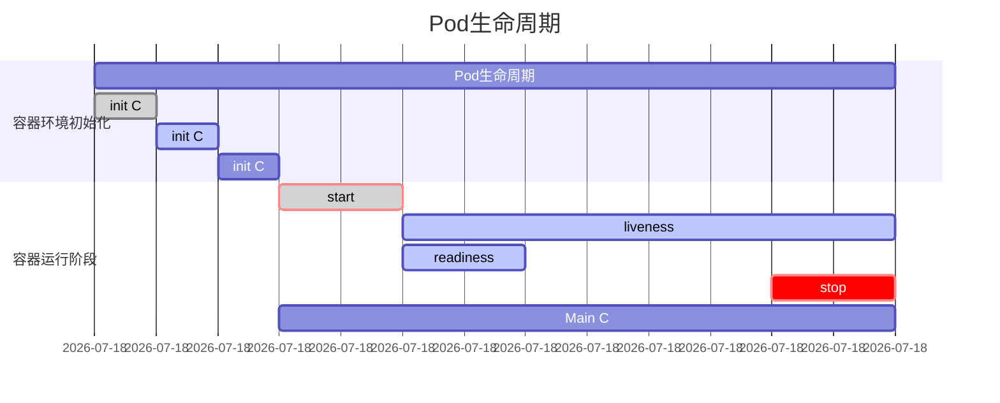

### gantt

```mermaid
gantt 
	title Pod生命周期
	dateFormat ss
	section 容器环境初始化
	Pod生命周期 : Pod, 01, 13s
	init C : done, init1, 01, 1s
	init C : active, init2, after init1, 1s
	init C : after init2, 1s
	section 容器运行阶段
	start : done, crit, start, 04, 2s
	liveness : active, liveness, 06, 8s
	readiness : active, readiness, 06, 2s
	stop : crit, stop, 12, 2s
	Main C : main, 04, 10s
```

