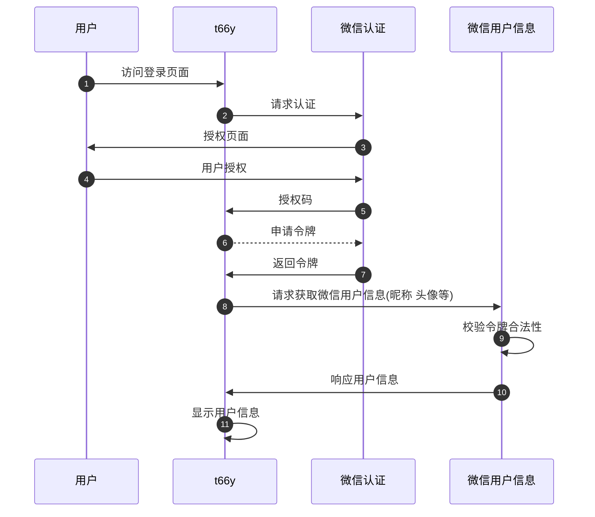

## 时序图

```mermaid
sequenceDiagram
	autonumber
	用户->>t66y: 访问登录页面
    t66y ->> 微信认证: 请求认证
    微信认证 ->> 用户: 授权页面
    用户 ->> 微信认证: 用户授权
    微信认证 ->> t66y: 授权码
    t66y -->> 微信认证: 申请令牌
    微信认证 ->> t66y: 返回令牌
    t66y ->> 微信用户信息: 请求获取微信用户信息(昵称 头像等)
    微信用户信息 ->> 微信用户信息: 校验令牌合法性
    微信用户信息 ->> t66y: 响应用户信息
    t66y ->> t66y: 显示用户信息
```