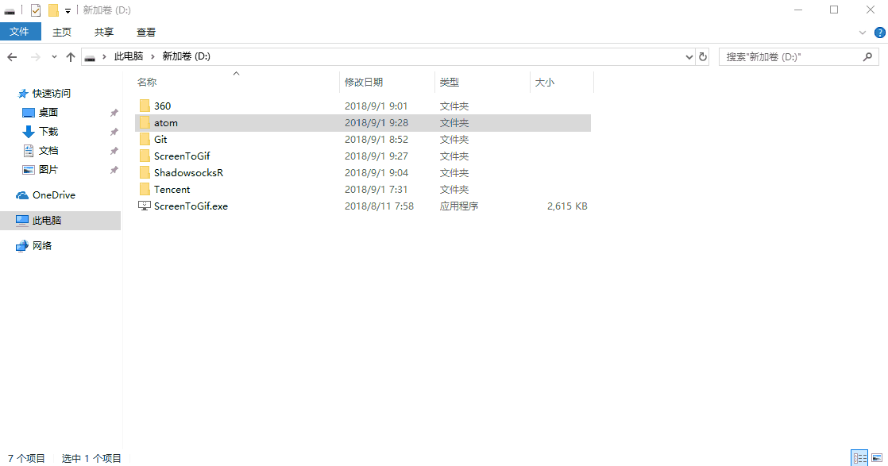

# atom

## 目录

[TOC]


**下载安装**

[**AtomSetup.exe**]这个安装程序会安装在C盘,特别无语(ˉ▽ˉ；)...

[**atom-x64-windows.zip**]推荐使用绿色解压版,想装哪里装哪里

关于gitthub文件下载慢的问题,影梭的md有详细说明.(`wget`先下到飞机场,然后再开启影梭,FileZilla下载到本地磁盘) or (使用国内镜像源下载 https://cnpmjs.org/mirrors/atom)

**修改默认插件安装位置**

需要在CMD中手动新建.atom文件

```shell
mkdir .atom
```



## 切换国内源

1. 切换到 `Atom` 安装目录下（`C:\Users\用户名\.atom`），编辑 `.apmrc` 文件。 
   将该文件内容改为：

```shell
registry=https://registry.npm.taobao.org/ 
strict-ssl=false 
```

**注：**是 `Atom` 安装目录，不是插件目录；如果 `Atom` 安装目录下没有 `.apmrc` 文件就新建一个

2. 添加文件后，发现安装插件还是报错，那是因为 apm 最终还是走的 npm 源，所以还需要更改 npm 源。 
   通过命令行：

```shell
npm config set registry https://registry.npm.taobao.org
```

3.  export PATH=$PATH:/usr/local/git/bin:/usr/local/bin` to ensure that `/usr/local/bin` in in my `PATH

保存文件后可通过 `apm install --check` 命令测试是否可以正常安装，然后就可以去 `Atom` 
里正常安装了 

## 插件

### 汉化

- simplified-chinese-menu

### 主题

- #### [atom-material-ui](https://atom.io/themes/atom-material-ui)

### 代码美化

- atom-beautify
- pretty-json
- atom-ctags

### 预览优化

- highlight-line

- highlight-selected

- atom-bracket-highlight

- **minimap**

  对查看文字内容的小地图，可以快速定位到你要找的地方，其中有很多衍生插件都非常有用，可以更高效的让你以纯文本编辑时的效率。

  - **minimap-highlight-selected**在小地图上高亮你文本中选中的内容。
  - **minimap-find-and-replace**在小地图上显示搜索匹配项。
  - **minimap-pigments**在小地图上显示颜色代码的颜色。
  - **minimap-linter**在小地图上显示代码的错误位置。这个`linter`有许多的语言代码纠错插件，可以根据你所需要用的开发语言找到对应的`linter`插件包进行安装。
  - **minimap-cursorline**在小地图上显示光标所在行以颜色区分显示。
  - **minimap-selection**在小地图上显示选中的块状内容。

- **symbols-tree-view**

  

### 代码补全

- kite 基于人工智能自动补全
- atom-ctags
- autocomplete-cmake
- autocomplete-python
- autocomplete-java

### 路径补全

- autocomplete-paths

### 意向猜测

- intentions

### 语法验证纠错

- linter

  针对开发人员提供的代码纠错规范的插件

- linter-python

### 注释

- **Docblockr**

  快速注释代码插件，`/*`或`/**`再`tab`即可

### 目录树

- file-icons
- logo-file-icons
- tree-view-sort

### 工具栏

- tool-bar

### XML

- autocomplete-xml
- xml-formatter

### html

- open-in-browser       快速打开默认浏览器查看html
- atom-html-preview   实时预览html

### 正则式

- regex-railroad-diagram

### markdown

- Markdown Preview Enhanced

  一般直接用Typora神器